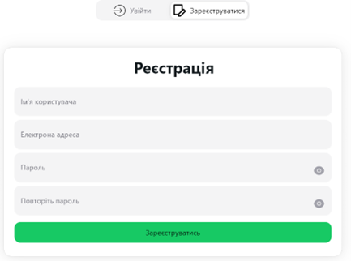

# Вебзастосунок для менеджменту офлайн-аукціонів

#### (Дипломний проєкт)

### Відео огляд:

[](https://www.youtube.com/watch?v=LwDmhNnPdqQ)

## Опис проєкту

Цей проєкт був створений для управління офлайн-аукціонами. Він дозволяє користувачам організовувати та брати участь в
аукціонах, здійснювати ставки в режимі реального часу, а також надає функціонал для адміністрування аукціонів, таких як
додавання нових лотів, керування учасниками та перегляд історії ставок.

## Особливості:

- ⚙️ **Керування аукціонами та лотами**
- 🔐 **Можливість реєстрації та входу користувачів**
- 🛠️ **Створення та редагування аукціонів для адміністратора**
- 💸 **Ставки в режимі реального часу**
- 📊 **Перегляд історії ставок для кожного лота**
- 🏆 **Повідомлення про завершення аукціону та переможця**

## Технології:

- **Back-End:** NestJS, Prisma, Socket.IO
- **Front-End:** React, NextUI, Tailwind
- **База даних:** PostgreSQL
- **Аутентифікація:** JWT

## Запуск проекту локально

### Вимоги

- Node.js v16+

### Інструкція

1. Клонуйте репозиторій:
   ```bash
   git clone https://github.com/MishaGontar/auction-front

2. Встановіть залежності:
   ```bash
   npm install

3. Налаштуйте .env файл з усіма необхідними змінними середовища:
    - `VITE_SERVER_URL`: URL [серверної](https://github.com/MishaGontar/auction-back) частини, який використовується для
      взаємодії з API. (Перед початком налаштуйте [сервер](https://github.com/MishaGontar/auction-back))
    - `CYPRESS_BASE_URL`: Базовий URL для тестів Cypress. Це має бути URL, на якому працює ваш фронтенд.
    - `CYPRESS_MAILOSAUR_API_KEY`: API ключ для Mailosaur, який використовується для тестування електронної пошти.
    - `CYPRESS_MAILOSAUR_SERVER_ID`: Ідентифікатор сервера Mailosaur.
    - `CYPRESS_EMAIL`: Електронна адреса, яка використовується для тестування.
    - `CYPRESS_USERNAME`: Ім'я користувача для авторизації під час тестування.
    - `CYPRESS_PASSWORD`: Пароль користувача для авторизації під час тестування.
    - `CYPRESS_AUTH_TOKEN`: Токен авторизації для автоматизованих тестів.
    - `CYPRESS_ADMIN_TOKEN`: Токен адміністратора для тестування функціоналу, що потребує прав адміністратора.

4. Запустіть сервер:
   ```bash
   npm run start

## Можливі покращення

- Зробити систему рейтингів для учасників.
- Додати можливість спілкування між учасниками через чат.
- Додати можливість оплачувати на сайті.

## Скріншоти

| Назва                                         | Зображення                                                                                                                    |
|-----------------------------------------------|-------------------------------------------------------------------------------------------------------------------------------|
| Авторизація                                   |                                                                                  |
| Вся інформація про аукціон                    |                                              |
| Вся інформація про лот                        |                                                      |
| Всі заяви, щоб стати продавцем                |                                     |
| Модальна форма створення лоту                 |                                       |
| Особистий профіль користувача                 |                                          |
| Редагування особистого профілю користувача    |              |
| Реєстрація                                    |                                                                                    |
| Список аукціонів                              |                                                                      |
| Список заблокованих користувачів для продавця |      |
| Сторінка лота для переможця лоту              |                                |
| Сторінка лота після натискання дії для ставки |  |
| Сторінка лота після ставки за користувача     |            |
| Сторінка лота після ставки за продавця        |                  |
| Сторінка списку всіх користувачів             |                                |
| Сторінка списку всіх лотів та аукціонів       |                |
| Форма двофакторної автентифікації             |                                  |
| Форма для редагування лоту                    |                                              |
| Форма редагування аукціону                    |                                                 |
| Форма створення аукціону                      |                                                     |
| Інформація про аукціон за продавця            |                            |
| Інформація заяви нового продавця              |                                  |
| Інформація про аукціон                        |                                                        |
| Інформація про продавця за власника           |                         |
| Інформація про продавця за користувача        |                    |
| Інформації про лот за власника                |                                    |
| Інформації про лот за гостя                   |                                          |
| Інформації про лот за користувача             |                              |
